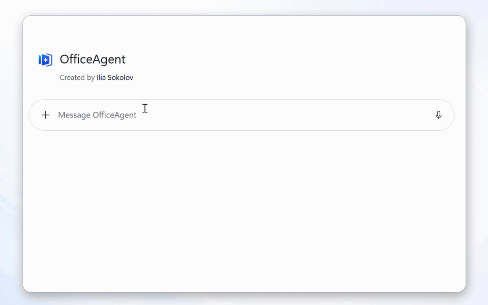

# OfficeAgent.NET
<!-- mcp-name: io.github.ilia-sokolov/officeagent -->

[](https://github.com/ilia-sokolov/OfficeAgent.NET/actions/workflows/build.yml)
[](https://www.nuget.org/packages/OfficeAgent.Core)
[](https://www.nuget.org/packages/OfficeAgent.Core)
[](LICENSE)

OfficeAgent.NET translates an AI agent’s intent into controlled changes to Microsoft Word documents. The agent proposes a typed edit plan; the library validates and applies it while preserving document features such as styles and comments. Edits can be recorded as tracked changes for human review, while structured document operations can reduce token use compared with processing entire files.




## What this project does

A `.docx` file is a package of related XML parts. A small text change can affect
runs, styles, numbering, comments, content controls, or revision markup.
OfficeAgent.NET handles that document-specific work. The model works with
structured document data and JSON-serialisable operations such as "replace this
clause as a tracked change" or "add a row to this table."

The same engine is available in three forms:

- an MCP server for agents that support the Model Context Protocol;
- tools for Microsoft Agent Framework and `Microsoft.Extensions.AI`;
- a .NET API for applications that want to control the workflow directly.

It currently supports Word `.docx` files. Excel and PowerPoint modules are not implemented. See
[Scope and limitations](#scope-and-limitations) before choosing it for a
workflow that depends on Word's layout or calculation engine.

## Choose a starting point

| I want to... | Start here |
| --- | --- |
| Add Word editing to a local MCP client | [Run the MCP server over stdio](#mcp-quick-start) |
| Connect Codex, Claude Code, Copilot Studio, or Microsoft 365 Copilot | [Deployment and client setup](docs/deployment.md) |
| Use OfficeAgent from C# | [Getting started](docs/getting-started.md) |
| Add tools to a Microsoft Agent Framework agent | [Agent integration](docs/agent-integration.md) |
| Host the MCP server or use SharePoint | [MCP server](docs/mcp-server.md) and [document providers](docs/document-providers.md) |
| Contribute | [Contributing](#contributing) |

## MCP quick start

Install the server as a .NET tool:

```bash
dotnet tool install --global OfficeAgent.Mcp
```

The following examples register it with Claude Code and limit its filesystem
connection to one directory.

macOS/Linux:

```bash
claude mcp add officeagent \
  --env OfficeAgent__FileSystemConnections__0__ConnectionId=documents \
  --env OfficeAgent__FileSystemConnections__0__RootPath=/absolute/path/to/documents \
  -- officeagent-mcp --stdio
```

PowerShell:

```powershell
claude mcp add officeagent `
  --env OfficeAgent__FileSystemConnections__0__ConnectionId=documents `
  --env OfficeAgent__FileSystemConnections__0__RootPath=C:\officeagent-documents `
  -- officeagent-mcp --stdio
```

Run `claude mcp list` to confirm that `officeagent` is connected. Then ask the
client to edit a file in the configured directory, for example:

> Change the payment terms in contract.docx from 30 to 45 days.

The server exposes tools to register, inspect, search, preview, and apply edits.
Text replacements are tracked changes by default. With the filesystem provider,
a successful apply normally writes a sibling such as `contract.v2.docx`, keeps
`contract.docx` unchanged, and returns the new document id for follow-up edits.

OfficeAgent does not send the complete `.docx` package through the model, but
the MCP client and model do receive document text and structure returned by the
inspect and find tools. Only connect document folders and model providers that
are appropriate for the data you are processing.

Configuration for other clients, streamable HTTP hosting, containers, and
SharePoint is in [Deployment and client setup](docs/deployment.md).
The server does not provide an authentication layer for HTTP hosting; put it
behind the authentication and network controls appropriate for your environment.

## .NET quick start

Install the core package and Word module:

```bash
dotnet add package OfficeAgent.Core
dotnet add package OfficeAgent.Word
```

After registering services and a document provider, the edit loop looks like
this:

```csharp
var client = services.GetRequiredService<OfficeAgentClient>();
var doc = await client.RegisterAsync("workspace", "/srv/workspace/contract.docx");

var inspect = await client.InspectAsync("workspace", doc.ItemId);
var hit = (await client.FindAsync(
    "workspace", doc.ItemId, new FindQuery("Acme Corp"))).First();

var plan = new DocumentPlan
{
    Snapshot = inspect.Snapshot,
    Operations = new PlanOperation[]
    {
        new ChangeTextOp
        {
            Target = hit.Anchor,
            With = "Globex Inc.",
            Mode = ChangeMode.Tracked
        }
    }
};

var preview = await client.PreviewAsync("workspace", doc.ItemId, plan);
if (preview.IsValid)
    await client.CommitAsync("workspace", doc.ItemId, plan);
```

The complete example, including service registration and reading the saved
file, is in [Getting started](docs/getting-started.md).
The minimal sample replaces the first `Acme Corp` with `Globex Inc.`. To run it,
copy a Word document containing `Acme Corp` to `contract.docx` in the cloned
repository root, then run:

```bash
dotnet run --project samples/QuickEdit -- ./contract.docx ./contract-edited.docx
```

The repository also contains an interactive
[Agent Framework sample](samples/AgentEdit/).

## How it works

Every edit follows the same four steps:

1. **Inspect** returns a structured map of the document: its outline,
   paragraphs, styles, content controls, tables, images, and revisions.
2. **Find** searches text and returns a content-verified anchor for each match.
3. **Preview** validates a plan against the current document and reports the
   proposed changes without writing.
4. **Apply** commits the complete plan and saves it through the configured
   provider.

A plan (`DocumentPlan`) is a typed, JSON-serialisable list of operations. An
anchor records both a location and the content expected there. If the content
or optional document snapshot has changed, validation fails instead of silently
targeting a different location. Applying a plan is all-or-nothing.

The Word module supports changes to text, paragraphs, tables, images, styles,
content controls, comments, document properties, and tracked revisions. The
full operation schema is documented in
[Document plans](docs/document-plans.md).

Documents are accessed through configured providers. After registration,
editing calls use a `(connectionId, documentId)` pair instead of a storage path
or credentials. The filesystem provider restricts registrations to its root;
the SharePoint provider uses the permissions of its configured identity.

## Documentation

| Guide | Covers |
| --- | --- |
| [Getting started](docs/getting-started.md) | A complete edit from service registration to reading the result |
| [Concepts](docs/concepts.md) | Anchors, snapshots, plans, providers, transactions, and capabilities |
| [Document plans](docs/document-plans.md) | JSON shapes and validation rules for every operation |
| [Document providers](docs/document-providers.md) | Filesystem, SharePoint, save modes, and custom providers |
| [Agent integration](docs/agent-integration.md) | Microsoft Agent Framework and `Microsoft.Extensions.AI` tools |
| [MCP server](docs/mcp-server.md) | Server configuration, transports, security notes, and tool contracts |
| [Deployment and client setup](docs/deployment.md) | Codex, Claude Code, Microsoft Copilot clients, containers, and Azure |
| [Operations](docs/operations.md) | Concurrency, streams, cancellation, telemetry, and production concerns |
| [Failure modes](docs/operations.md#failure-modes-you-should-handle) | Common plan errors and what to do next |

## Contributing

Bug reports, documentation fixes, new Word operations, provider integrations,
and focused test cases are useful contributions. If you found a problem,
[open an issue](https://github.com/ilia-sokolov/OfficeAgent.NET/issues) with the
document feature involved, the operation you attempted, and the error or
unexpected result. Do not attach confidential documents; a small sanitised
reproduction is enough.

To work on the code, install the .NET 8 SDK, fork the repository, and run:

```bash
dotnet build OfficeAgent.NET.sln
dotnet test OfficeAgent.NET.sln
```

Before starting a larger change, especially one that changes public types or
the JSON wire format, [open an issue](https://github.com/ilia-sokolov/OfficeAgent.NET/issues)
so the design can be discussed. See
[CONTRIBUTING.md](CONTRIBUTING.md)
for code style, tests, and pull-request expectations.

## Scope and limitations

OfficeAgent.NET edits Word `.docx` files; it does not automate the Word desktop
application. Excel and PowerPoint modules can be added through `IFormatModule`,
but they do not ship today.

The engine does not render pages or calculate Word fields. Operations that
depend on pagination, table-of-contents rendering, field recalculation, or
page-fit checks are outside its scope. Preview reports structural changes, not
a visual rendering of the final document. Test the workflow on representative
documents and keep human review in the loop for consequential edits.

## Commercial support

OfficeAgent.NET is MIT-licensed and can be self-hosted. Managed hosting and
commercial support are available from dotaction:
[contact dotaction](mailto:contact@dotaction.io?subject=OfficeAgent.NET%20commercial%20support).

## License

MIT. See [LICENSE](LICENSE).
